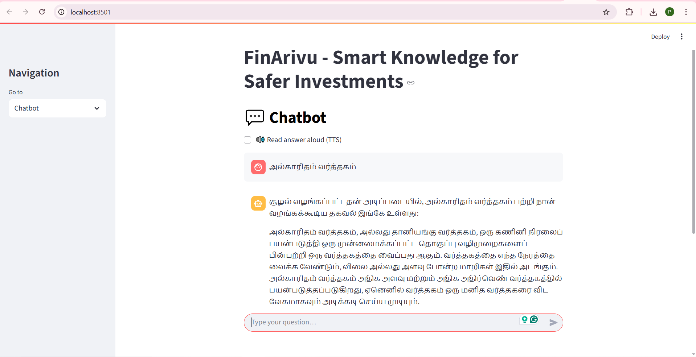
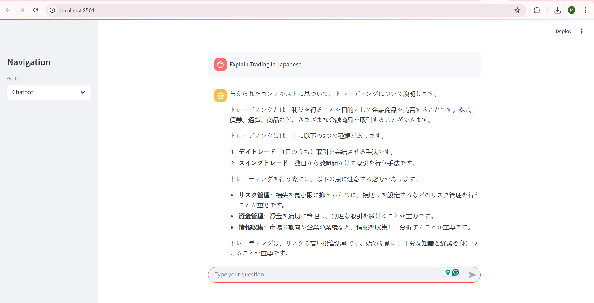
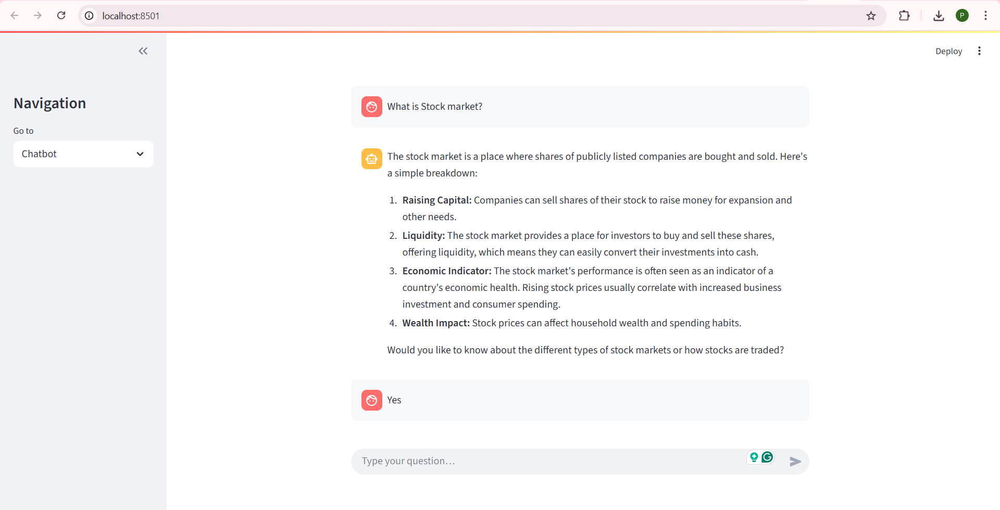
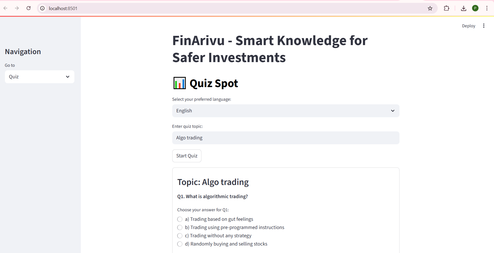
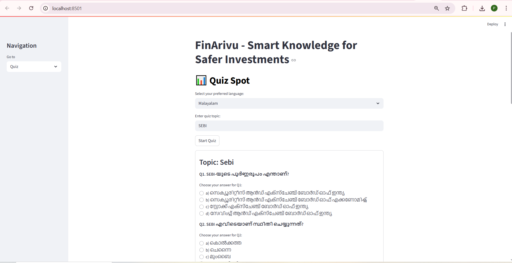

# 💬📊 FinArivu  

**FinArivu** is an intelligent, multilingual financial literacy platform designed to help individuals and families make informed financial decisions.  
Built using **Streamlit**, **LangChain**, **Google Gemini AI**, and **HuggingFace embeddings**, it combines a **smart chatbot** with an **interactive quiz module** to make finance education simple, accessible, and engaging.  

---

## ✨ Features  

### 🔹 1. Multilingual Chatbot 💬  
- Supports **29+ languages** (English, Hindi, Tamil, Telugu, Bengali, Urdu, Mandarin Chinese, Spanish, Arabic, French, Russian, German, Japanese, and more).  
- **Text-to-Speech (TTS):** Speaks answers aloud in the user’s language.  
- **Financial Guidance:** Beginner-friendly explanations on savings, investments, loans, insurance, and money management.  
- **Conversational Flow:** Can ask clarifying questions when queries are vague.  
- **Context-Aware Responses:** Uses **RAG** (Retrieval-Augmented Generation) with **Chroma database** to fetch relevant documents and provide accurate, up-to-date answers.  

### 🔹 2. Interactive Quiz Module 📊  
- **Custom Quizzes:** Enter any finance-related topic to generate **10 multiple-choice questions**.
- **RAG-Powered Retrieval:** Uses **RAG** (Retrieval-Augmented Generation) with the **Chroma database** to fetch relevant financial information and generate context-aware quiz questions.
- **Multilingual Support:** Quizzes available in all 29+ supported languages.  
- **Randomized Options:** Shuffles answer options while keeping correctness intact.  
- **Explanations Included:** Each question has a beginner-friendly explanation.  
- **Performance Tracking:** Shows scores, correct/incorrect answers, and explanations.  
- **Retry Anytime:** Generate quizzes on new topics with one click.  

---

## 🛠 Tech Stack  

- **Frontend & Framework:** [Streamlit](https://streamlit.io/)  
- **Language Model API:** Google Gemini AI (`gemini-2.0-flash-001`)  
- **Embeddings:** HuggingFace `sentence-transformers/all-MiniLM-L6-v2`  
- **Vector Database and RAG:** [Chroma](https://www.trychroma.com/) used for **RAG** (Retrieval-Augmented Generation) to provide context-aware answers and quiz questions 
- **Text-to-Speech (TTS):** [gTTS](https://pypi.org/project/gTTS/)  
- **Audio Playback:** `sounddevice`, `soundfile`  
- **Language Detection:** [langid](https://pypi.org/project/langid/)  
- **Environment Management:** `python-dotenv`  

---

## ⚙️ Installation & Local Setup  

### 1. Clone the Repository  
```bash
git clone <your-repo-url>
cd FinArivu
````

### 2. Create a Virtual Environment (Recommended)

```bash
python -m venv venv
venv\Scripts\activate 
```

### 3. Install Dependencies

```bash
pip install -r requirements.txt
```

### 4. Add Environment Variables

Create a `.env` file in the project root:

```env
GOOGLE_API_KEY=your_google_gemini_api_key
```

### 5. Run the App

```bash
streamlit run app.py
```

🔗 The app will open in your browser at:
`http://localhost:8501`

---

## 📂 Project Structure

```
FinArivu/
│── main.py             # Main Streamlit app entry point
│── chatbot.ipynb       # Handles chatbot logic, Gemini integration, Chroma storage, and RAG retrieval
│── quiz_st.py          # Quiz generation, scoring, and explanations logic using streamlit
│── app.py              # Chatbot logic with TTS functionality and Helper functions (language detection, formatting, etc.)
│── requirements.txt    # List of dependencies
│── .env                # API key configuration (not to be committed)
│── README.md           # Project documentation
│── /PDF data           # Financial documents & resources for Chroma DB
│── /screenshots        # App screenshots (Chatbot, Quiz pages)
```

---

## 📸 Screenshots

### 💬 Chatbot Page





### 📊 Quiz Page




---

## 🎥 Demo Video

👉 [Watch the demo here](https://drive.google.com/file/d/1wHGDbov_vCQGexn6VPprrPNoE6-MW4_b/view?usp=sharing)

---

## 🚀 Usage

### 🔹 Chatbot

1. Enter your financial question in any supported language.
2. Enable **TTS** to hear the answer aloud.
3. Get **context-aware**, beginner-friendly financial guidance.

### 🔹 Quiz

1. Enter a **finance topic** (e.g., "Mutual Funds", "Personal Loans").
2. Select your preferred language.
3. Answer **10 MCQs**.
4. View your **score, explanations, and retry**.

---

## 🔮 Future Enhancements

* 🎙 Voice input for chatbot queries.
* 📈 Personalized financial goal tracking.
* 🎯 Quiz difficulty levels & progress analytics.
* 📰 Real-time financial news integration.
* 💹 Virtual trading simulation with delayed market data to practice portfolio management and investment strategies.

---

## 📜 License

This project is licensed under the MIT License.
Use, modify, and share freely with proper attribution.

---

